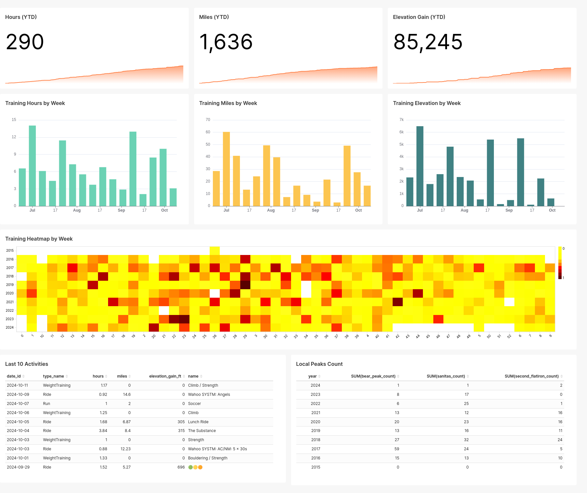

## Overview

ETL pipeline that extracts activity data from the Strava API, transforms it with Pandas, and loads it into a PostgreSQL data warehouse. Apache Superset is used for dashboards and visualizations. The full stack runs locally in Docker.

<p align="left">

</p>

## Architecture

```
Strava API ──► get_activities.py ──► data/raw/      ──► DataHandler ──► PostgreSQL
                 (OAuth + requests)     (CSV files)      (Pandas ETL)
                                                                            │
                                                                            ▼
                                                                        Superset
                                                                       (dashboard)
```

## Technologies Used


## Prerequisites

- Docker and Docker Compose
- A [Strava API application](https://www.strava.com/settings/api) (free)

## Strava API Setup

1. Create an app at [strava.com/settings/api](https://www.strava.com/settings/api)
2. Copy `.env.example` to `.env` and fill in your `client_id` and `client_secret`
3. Complete the OAuth flow to get your initial access and refresh tokens
4. Save the token response JSON to `app/etl/.creds`:

```json
{
  "access_token": "...",
  "refresh_token": "...",
  "expires_at": 1234567890
}
```

The app automatically refreshes expired tokens using the refresh token.

## Environment Variables

| Variable | Description |
|---|---|
| `client_id` | Strava API application client ID |
| `client_secret` | Strava API application client secret |

## Quick Start

```bash
# start postgres and run the ETL pipeline
make run

# rebuild a specific service after changes
make build-db
make build-app

# connect directly to the postgres database
make db-connect
```

To refresh activity data from the Strava API before processing, pass `refresh` to the container entrypoint (see `app/docker_entrypoint.sh`).

## Dashboard

Apache Superset runs locally in Docker. To connect Superset to the Postgres database:

- Host: `host.docker.internal`
- Port: `5433`
- Database: `activities`
- Username: `postgres`
- Password: `postgres`

## Data Model

Activities are normalized into four tables:

| Table | Key | Description |
|---|---|---|
| `activities` | `id` | Core activity metrics (distance, time, elevation) |
| `dates` | `date_id` | Date dimension (year, month, week, day) |
| `types` | `type_id` | Activity type dimension (run, ride, ski, etc.) |
| `counts` | `activity_id` | Custom route repeat counts |

## Project Structure

```
├── docker-compose.yml
├── app/
│   ├── Dockerfile
│   ├── requirements.txt
│   ├── config.yml              # database connection config
│   └── etl/
│       ├── main.py             # pipeline entrypoint
│       ├── get_activities.py   # strava api client
│       ├── datahandler.py      # pandas transformations
│       ├── dbconnection.py     # postgres connection context manager
│       └── schemas.py          # column definitions and type mappings
├── database/
│   ├── Dockerfile
│   └── sql/
│       ├── create_database.sql
│       └── create_dataset.sql
└── assets/
    └── dashboard.png
```
